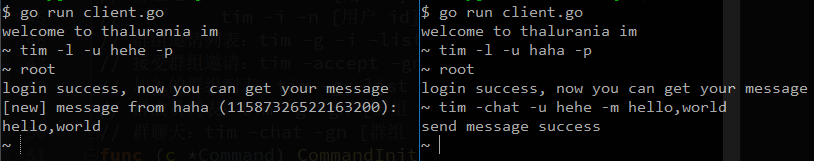

# thalurania

thalurania is a simple im server writen in golang.

## Features
 * Light weight
 * High performance
 * Pure Golang
 * Supports single push, multiple push and broadcasting
 
 ## Snapshot
 
 
 ## Command
 ```
    注册：    
        tim -r -u [用户名] -p
    登录：    
        tim -l -u [用户名] -p
    登出： 
        tim -q
    搜索： 
        tim -s -u [用户名]
        tim -s -n [用户 id]
        tim -s -g -gn [用户组 id]
    好友请求：
        tim -add -u [用户名]
        tim -add -n [用户 id]
    好友请求列表：
        tim -fr -list
    接受好友请求：
        tim -accept -u [用户名]
        tim -accept -n [用户 id]
    好友列表：
        tim -f -list
    与好友聊天：
        tim -chat -u [用户名] -m [消息内容]
        tim -chat -n [用户 id] -m [消息内容]
    查看离线消息：
        tim -o -u [用户名]
        tim -o -n [用户 id]
    创建群组：
        tim -add -g
    群组邀请：
        tim -i -u [用户名] -gn [群组 id]
        tim -i -n [用户 id] -gn [群组 id]
    群组邀请列表：
        tim -g -i -list
    接受群组邀请：
        tim -accept -gn [群组 id]
    加入的群组列表：
        tim -g -list
    群成员列表：
        tim -g -gn [群组 id] -list
    群聊天：
        tim -chat -gn [群组 id] -m [消息内容]
 ```
 ## LICENSE
 thalurania is distributed under the terms of the GPL-3.0 License.